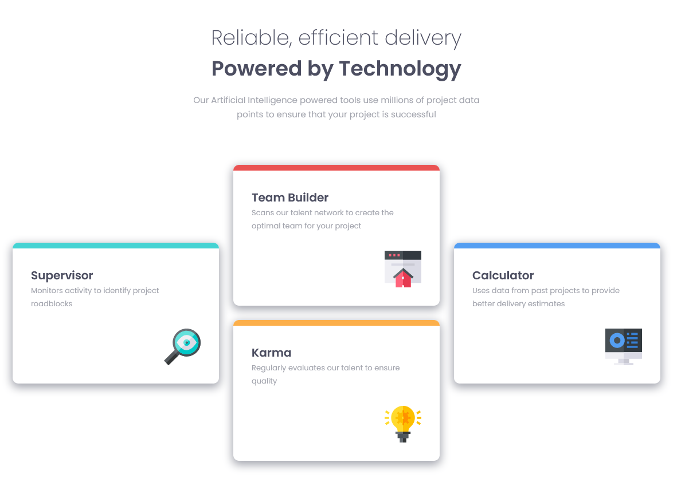

# Frontend Mentor - Four card feature section solution

This is a solution to the [Four card feature section challenge on Frontend Mentor](https://www.frontendmentor.io/challenges/four-card-feature-section-weK1eFYK). Frontend Mentor challenges help you improve your coding skills by building realistic projects. 

## Table of contents

- [Overview](#overview)
  - [The challenge](#the-challenge)
  - [Screenshot](#screenshot)
  - [Links](#links)
- [My process](#my-process)
  - [Built with](#built-with)
  - [What I learned](#what-i-learned)
  - [Useful resources](#useful-resources)
- [Author](#author)

## Overview

### The challenge

Users should be able to:

- View the optimal layout for the site depending on their device's screen size

### Screenshot



### Links

- Solution URL: [github](https://github.com/peninoule/fem-four-card-feature)
- Live Site URL: [Vercel](https://fem-four-card-feature-coral.vercel.app/)

## My process

### Built with

- Semantic HTML5 markup
- Flexbox
- CSS Grid
- Mobile-first workflow
- [vite](https://vitejs.dev/guide/features.html) 
- [Sass](https://sass-lang.com/)

### What I learned

Discovered Grid Templates areas and it seems really powerfull.

Start by naming your grid areas (use a "." for empty cells)

```css
.grid {
  display: grid;
  grid-template-areas: 
    ".  r1  ."
    "g1 r2 b1"
    "g2 y1 b2"
    ".  y2  ."
```

Then you can place your items using the gris areas names. For example, I want the red item to be placed column 2, row 1 and 2:

```css
.red-item {
  grid-column: 2;
  grid-row: r1 / r2;
}
```

### Useful resources

- [Grid Template Area](https://www.youtube.com/watch?v=CVKbe4RaUZQ&t=260s) - Here's a link to a great vidéo made by the all mighty Kevin Powell that explains grid area templates very well.

## Author

- Frontend Mentor - [@peninoule](https://www.frontendmentor.io/profile/peninoule)

